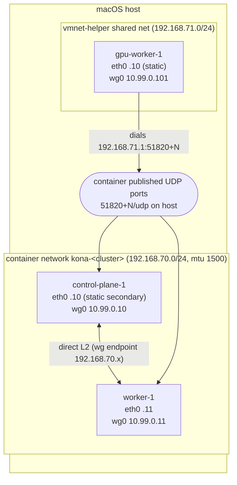

# Networking design

Status: **Phase 0 result. Option (c), a WireGuard overlay, is chosen
provisionally.** Option (b) still needs one root-only check (pf rules). The
sleep/wake and Wi-Fi-change tests are still pending. See "Open items".

## Constraints observed on macOS 26.6.2 / container 1.4.1 / vmnet-helper 0.13.0

All of these come from real runs, in `spikes/03-net/*.txt` and [gates.md](gates.md).

1. **krunkit cannot join a `container` network.** `container` creates its
   networks with macOS 26's `vmnet_network` API inside its own XPC plugin
   (`container-network-vmnet`). A vmnet-helper interface asking for the same
   subnet fails with `vmnet_start_interface: (unknown status)`.
2. **Separate vmnet networks are isolated from each other**, even though the
   host has `net.inet.ip.forwarding=1` and connected routes to every bridge.
   tcpdump shows a container's echo request entering `bridge102` and never
   leaving on `bridge101`. Two `container` networks (`default` and
   `kona-spike`) can't reach each other either. The filter isn't visible
   without root (`pfctl` needs `/dev/pf`).
3. **vmnet-helper instances with the same subnet share one bridge.** Every
   krunkit node on 192.168.65.0/24 lands on the same `bridge101` (L2
   adjacent), so GPU↔GPU traffic is direct.
4. **A vmnet-helper that asks for a colliding subnet can hang forever** in
   `vmnet_start_interface` (SIGTERM is ignored while it blocks). Any later
   helper reusing the same `--interface-id` hangs too. kona runs helpers with
   a 10 s start timeout, SIGKILLs on timeout, and generates a fresh interface
   ID per start.
5. **`container` IPs are not stable.** The address is allocated sequentially
   per run and **not** tied to the pinned MAC (the same MAC got .5, then
   .6). There is no `--ip` flag. A secondary static address added in the guest
   (`ip addr add`) is reachable from peers on that network **and from the
   host**.
6. **Default container MTU is 1280.** `--network <net>,mtu=1500` works.
   vmnet-helper networks are 1500.
7. **Published ports work for UDP.** `container run -p 51821:51821/udp` is
   served by a userspace proxy in `container-runtime-linux`. A krunkit VM
   reaches it at its own gateway (`192.168.65.1:51821`), and the container sees
   the source as its own gateway (`192.168.66.1:<port>`), so it is NATed.
8. **The vmnet gateway DNS forwarder can be broken.** On this host
   `192.168.64.1:53` refuses queries while `8.8.8.8` works. kona always passes
   the host's primary resolver explicitly (`--dns`, cloud-init
   `nameservers`), and the builder does the same (`container build --dns`).
9. **Unix socket paths are limited to 103 bytes.** Helper and krunkit API
   sockets live under `/tmp/kona-<uid>/<cluster>/` (0700), not in
   `~/Library/Application Support/...`.

## Options evaluated

| Option | Result | Notes |
|--------|--------|-------|
| (a) krunkit on the same vmnet subnet as `container` | **Not possible** | The subnet is refused (constraint 1). A routed separate subnet is really option (b). |
| (b) Route through the host (`pf` / `ip.forwarding`) | **Blocked by default**, and the fix is unverified | Forwarding is already on and routes exist, but the bridges are isolated (constraint 2). A kona pf anchor with `pass` rules between the kona bridges *might* lift it. That needs `sudo pfctl` to inspect Apple's `com.apple/*` anchors and to load an anchor. |
| (c) WireGuard overlay between nodes | **Works without root** | 0% loss both ways. The overlay preserves source IPs (tcpdump on `wg0` shows 10.99.0.x on both ends). With a 1500 underlay, the full 1420 MTU passes with DF. ~365 Mbit/s each way through the published-port proxy (the bottleneck is the proxy, not WireGuard). |
| rejected: L2 relay through a "gateway" container (`--publish-socket` + krunkit `unixstream`) | Not pursued | vmnet filters per-VM MACs. It would need bridging/promiscuous mode inside a guest, is fragile, and still runs through a userspace hop. |

## Chosen design: (c) kona-managed WireGuard mesh as the node network

- **Node IP** = the static `wg0` address from `10.99.0.0/24` (configurable),
  assigned by kona and stored in state. It's identical across reboots and
  independent of vmnet DHCP/allocation. k3s: `--node-ip=<wg0> --flannel-iface=wg0`.
  kubeadm: `--apiserver-advertise-address=<wg0>` on the control plane.
- **Underlay addresses** are static too. Container nodes get a pinned MAC plus
  a secondary static `eth0` address set by the node entrypoint (constraint 5),
  and GPU nodes get a static cloud-init address. These are the WireGuard
  endpoints and the address the host uses to reach the API server.
- **Peering**: full mesh.
  - CPU↔CPU: endpoints on the container network (direct L2, fast path).
  - GPU↔GPU: endpoints on the vmnet-helper bridge (direct L2).
  - GPU→CPU: every container node publishes its WireGuard port on the host
    (`-p <51820+N>:51820/udp`; kona allocates N per cluster and records it in
    state). GPU nodes dial `192.168.71.1:<port>` with `PersistentKeepalive=25`.
    CPU nodes have no endpoint for GPU peers and learn it from the handshake.
- **MTU budget**: underlay 1500 → `wg0` 1420 → flannel VXLAN 1370, or Cilium
  VXLAN/Geneve 1370/1370. Cilium native routing on `wg0` is possible but
  needs pod CIDRs in AllowedIPs. Phase 2 uses Cilium VXLAN over `wg0`, and
  native routing stays an option.
- **API server from the host**: `https://<control-plane static eth0>:6443`,
  reachable directly because the host sits on the container bridge. No port
  publish is needed. The kubeconfig uses that address, and the cert SANs
  include it plus the `wg0` IP.
- **No NAT between nodes** at the Kubernetes layer: node-to-node and
  pod-to-pod traffic carries real 10.99.0.x / pod IPs inside the tunnel. The
  only NAT is the published-port proxy *underneath* WireGuard on GPU↔CPU
  paths.
- **No sudo** anywhere in this design.

### Trade-offs

- GPU↔CPU throughput is ~365 Mbit/s (a userspace UDP proxy). That's plenty
  for the control plane, image pulls through the registry, and inference
  requests, but not for bulk data between CPU and GPU pods. GPU↔GPU and
  CPU↔CPU run at native vmnet speed.
- WireGuard adds 60 bytes of overhead and some CPU for crypto. The kona kernel
  has `CONFIG_WIREGUARD=y` built in, and Fedora has it as a module.
- If option (b) turns out to work with a single named `sudo pfctl` operation,
  it can become an opt-in `--network-mode routed` for native GPU↔CPU
  bandwidth. The WireGuard mesh stays the no-root default.

## Open items (need user action before Phase 1)

1. **pf inspection for option (b).** This is root-only and read-only:
   `sudo pfctl -sA` and `sudo pfctl -a com.apple -sA`, then `-sr` on each
   anchor, which shows whether the isolation is a pf rule that a `pass quick`
   anchor can override.
2. **Sleep/wake is not tested yet** (deferred by the user). Plan: run
   `pmset sleepnow` with the mesh up, then wake, and check handshake age, ping,
   and `chronyc tracking` skew. The expectation, which is **not verified**, is
   that guest clocks fall behind by the sleep duration until chrony steps them.

## Wi-Fi change behavior (verified)

`spikes/03-net/wifi-toggle.sh` ran twice with the mesh up. It turns Wi-Fi off
for ~8 s, then back on. Outputs are in `wifi-toggle-run1.txt` and
`wifi-toggle-run2.txt`.

| Path | Wi-Fi off | Wi-Fi back |
|------|-----------|------------|
| vmnet bridges (`bridge100-102`) | kept | kept |
| host → node static IPs | ok | ok |
| CPU↔CPU / GPU↔GPU (direct L2) | ok | ok |
| GPU↔CPU over WireGuard (published-port proxy) | ok | **run 1: broken, healed within ~40 s without a re-handshake; run 2: no outage (≤3 s)** |
| node → internet (vmnet NAT) | fails, as expected | ok |

vmnet networks are host-local and don't depend on the uplink, so Wi-Fi changes
never touch intra-cluster L2 paths. The GPU↔CPU path goes through
`container`'s userspace UDP proxy and can stall briefly when the host's
primary interface changes. `PersistentKeepalive=25` re-establishes the flow.
kona's node agent treats a handshake older than 3 × keepalive as degraded and
bounces the peer endpoint (`wg set ... endpoint`) to force a new flow.
`kona get nodes` surfaces it.
