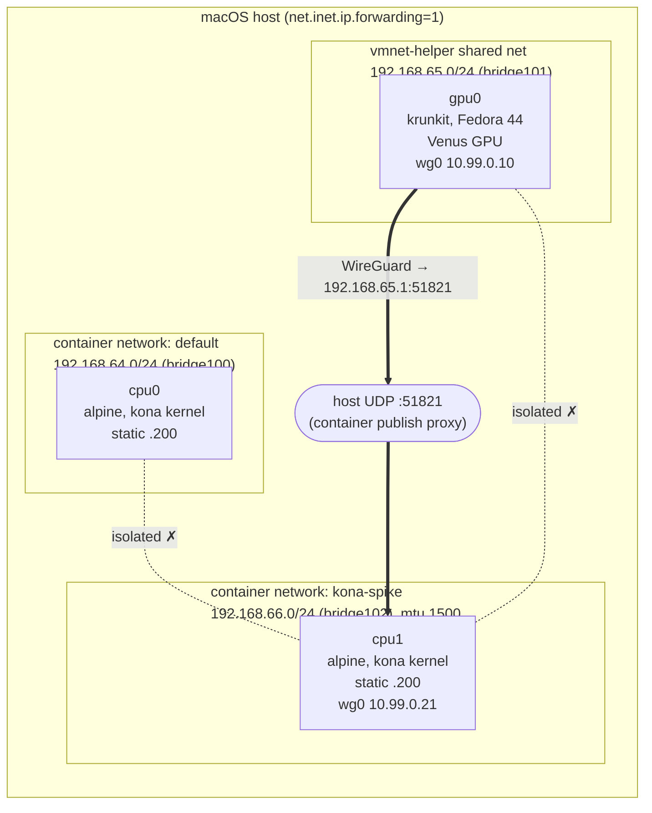

# kona playground: reproduce Phase 0 by hand

A hands-on walkthrough of every Phase 0 experiment: the custom guest kernel,
a krunkit VM with Vulkan-over-Venus, and the networking between Apple
`container` VMs and krunkit VMs. Each step is a script in `spikes/`, prints
real output, and can be re-run. The results are summarized in
[gates.md](gates.md), and the reasoning is in [kernel.md](kernel.md),
[gpu.md](gpu.md) and [networking.md](networking.md).

All of this was verified end to end from a clean slate on macOS 26.6.2, on an
Apple M3 Pro with 18 GiB.

## What you'll build



The bridge numbers (`bridge100`, `bridge101`, …) depend on creation order.
The scripts look them up by gateway IP.

## 0. Prerequisites

| Need | Check | Install |
|------|-------|---------|
| Apple silicon, macOS 26+ | `sw_vers; uname -m` | n/a |
| Apple `container` ≥ 1.4.1 | `container --version` | `brew install container && container system start` |
| krunkit ≥ 1.3.2 | `krunkit --version` | `brew tap libkrun/krun && brew trust --formula libkrun/krun/krunkit libkrun/krun/libkrun libkrun/krun/libkrunfw libkrun/krun/virglrenderer-krun libkrun/krun/gvproxy && brew install libkrun/krun/krunkit` |
| vmnet-helper ≥ 0.13.0 | `$(brew --prefix vmnet-helper)/libexec/vmnet-helper --version` | `brew tap nirs/vmnet-helper && brew trust nirs/vmnet-helper && brew install vmnet-helper` |
| tcpdump on host bridges without sudo | `id -Gn \| grep access_bpf` | Wireshark's ChmodBPF, or skip the tcpdump parts |
| ~6 GB RAM, ~4 GB disk free | n/a | n/a |

If you ever used `slp/krunkit`, remove it first. That tap is deprecated and
stuck on 1.1.1:
`brew list --full-name | grep '^slp/krunkit/' | xargs brew uninstall; brew untap slp/krunkit`.

Nothing here needs `sudo`.

## 1. Custom kernel for Apple `container`

### 1a. See what the default kernel lacks

```sh
spikes/01-kernel/check-config.sh kernel/base-arm64.config | grep -v ' y$'
```

`kernel/base-arm64.config` is the running default kernel's `/proc/config.gz`.
Regenerate it with
`container run --rm alpine:3.22 zcat /proc/config.gz > kernel/base-arm64.config`.

### 1b. Build it (inside a `container` VM, no Docker)

```sh
make -C kernel          # builder image → download + sha256 check → build
ls kernel/out/          # vmlinux-6.18.35-kona, config-…, .sha256
```

This is a full kernel build in an 8-vCPU / 8 GB VM, so expect it to take a
while. `build.sh` fails with the exact `CONFIG_*` name if a fragment option
doesn't survive `olddefconfig`.

### 1c. Boot and probe: default kernel vs kona kernel

```sh
spikes/01-kernel/probe.sh                                      > /tmp/default.txt
spikes/01-kernel/probe.sh "$PWD/kernel/out/vmlinux-6.18.35-kona" > /tmp/kona.txt
diff /tmp/default.txt /tmp/kona.txt
```

Expected diff: the tc BPF options go from `not set` to `y`, the
geneve/wireguard/dummy/netkit links go from `FAIL` to `ok`, and `clsact`
attaches. `lsmod` is empty on both, because the kernel is monolithic and has
no `/proc/modules`.

**Try:** add an option to `kernel/kona.config` that depends on something off
(say `CONFIG_NET_ACT_CT=y` without `NF_FLOW_TABLE`) and watch `build.sh` name
it and fail.

## 2. krunkit VM with a Venus GPU

First fetch and verify the Fedora image (`up.sh` does not download it):

```sh
mkdir -p spikes/02-krunkit/work && cd spikes/02-krunkit/work
B=https://dl.fedoraproject.org/pub/fedora/linux/releases/44/Cloud/aarch64/images
curl -fLO $B/Fedora-Cloud-44-1.7-aarch64-CHECKSUM
curl -fLO $B/Fedora-Cloud-Base-Generic-44-1.7.aarch64.qcow2
grep 'SHA256 (Fedora-Cloud-Base-Generic' Fedora-Cloud-44-1.7-aarch64-CHECKSUM   # compare with:
shasum -a 256 Fedora-Cloud-Base-Generic-44-1.7.aarch64.qcow2
cd -
```

Then boot:

```sh
spikes/02-krunkit/up.sh            # name=gpu0 ip=192.168.65.10 mac=52:54:00:6b:00:10
```

What `up.sh` does:

1. Makes an APFS clone of the image (`cp -c`, instant) as the root disk.
2. Builds a cloud-init NoCloud seed ISO with `hdiutil`: user `kona`, an SSH
   key in `work/id_ed25519`, a static IP matched by MAC, and your host's DNS
   server. It also installs the **patched Mesa from COPR
   `slp/mesa-libkrun-vulkan`**, pinned by `MESA_VERSION` in `versions.env`.
3. Starts `vmnet-helper` in shared mode on 192.168.65.0/24, socket under
   `/tmp/kona-$UID/spike/`.
4. Starts `krunkit` fully detached (4 vCPU, 4 GiB) and waits for SSH plus
   `cloud-init status --wait`.

Then:

```sh
source spikes/03-net/lib.sh       # gives you vmssh / cexec helpers (bash)
vmssh 'vulkaninfo --summary' | grep -E 'deviceName|driverName|apiVersion'
#   apiVersion = 1.2.0   deviceName = Virtio-GPU Venus (Apple M3 Pro)   driverName = venus
#   (+ llvmpipe, the CPU fallback: the DRA driver must ignore it)
vmssh 'ls -l /dev/dri; sudo dmesg | grep "\[drm\]"'
```

**Try: see upstream Mesa fail.** Revert to Fedora's Mesa and watch Venus
break with `ERROR_OUT_OF_HOST_MEMORY` (the host rejects `RESOURCE_MAP_BLOB`,
virtio-gpu command 0x208):

```sh
vmssh 'sudo dnf -y --disablerepo="copr:*" distro-sync mesa-vulkan-drivers mesa-filesystem; vulkaninfo --summary 2>&1 | tail -2; sudo dmesg | tail -2'
# put it back:
vmssh 'sudo dnf -y install --allow-downgrade mesa-vulkan-drivers-25.3.6-102.fc44 mesa-filesystem-25.3.6-102.fc44'
```

**Try:** the host console log is in `spikes/02-krunkit/work/gpu0/console.log`.
The krunkit REST API is at
`curl --unix-socket /tmp/kona-$UID/spike/gpu0.api http://localhost/vm/state`.

Stop it with `spikes/02-krunkit/down.sh gpu0`. The disk is kept, so `up.sh`
boots it again.

## 3. Networking

### 3a. Start CPU "nodes"

```sh
# cpu1 on a new network kona-spike (192.168.66.0/24), WireGuard port published on the host
spikes/03-net/cpu-up.sh cpu1 52:54:00:6b:00:21 192.168.66.200 51821
# cpu0 on container's default network, used to show network-to-network isolation
NET=default spikes/03-net/cpu-up.sh cpu0 52:54:00:6b:00:20 192.168.64.200
```

Each node is Alpine on the kona kernel with a pinned MAC, `mtu=1500`, and
your DNS server. It gets a **static secondary IP (.200)** because
`container`'s own address changes on every run even with a pinned MAC. Watch
that happen:

```sh
for i in 1 2; do container rm -f t >/dev/null 2>&1
  container run -d --progress none --name t --network kona-spike,mac=52:54:00:6b:00:99 alpine:3.22 sleep 30 >/dev/null
  container ls | awk '$1=="t"{print $6}'; done; container rm -f t
ping -c1 192.168.66.200      # the static secondary is reachable from the host
```

### 3b. Options (a) and (b): see the isolation

```sh
spikes/03-net/isolation.sh
```

This shows three things:
- (a) vmnet-helper refuses the container network's subnet
  (`vmnet_start_interface: (unknown status)`).
- (b) the host has forwarding on and routes to every bridge, yet tcpdump shows
  echo requests entering the container bridge and never leaving on the krunkit
  bridge.
- cpu0 (default network) can't reach cpu1 (kona-spike) either.

### 3c. Option (c): WireGuard overlay

```sh
spikes/03-net/wg-up.sh       # cpu1=10.99.0.21 listens on 51821; gpu0=10.99.0.10 dials 192.168.65.1:51821
spikes/03-net/measure.sh     # MTU, overlay source IPs (tcpdump), DF path MTU, iperf3 both ways
container exec cpu1 wg show  # note the peer endpoint 192.168.66.1:<port> = the host proxy
```

Reference numbers: 0% loss, receivers see 10.99.0.x (no NAT inside the
tunnel), 1420-byte DF packets pass, and **~365–390 Mbit/s** each way. The
ceiling comes from `container`'s userspace UDP publish proxy, not from
WireGuard.

**Try:**
- `WG_MTU=1280 spikes/03-net/wg-up.sh && spikes/03-net/measure.sh`: the
  MTU/throughput trade-off.
- Recreate cpu1 **without** `mtu=1500` (edit `cpu-up.sh`) and the largest DF
  payload drops to 1300. That's the 1280 default underlay.
- `lsof -nP -iUDP:51821` shows which process is the proxy
  (`container-runtime-linux`).
- Bounce the endpoint by hand, as kona's node agent will:
  `vmssh 'sudo wg set wg0 peer <cpu1-pubkey> endpoint 192.168.65.1:51821'`.

### 3d. Wi-Fi change (disruptive: drops your network for ~10 s)

```sh
spikes/03-net/wifi-toggle.sh      # WIFI_IF=en0 by default
```

Observed so far: the bridges, static IPs and L2 paths are never affected. The
GPU↔CPU tunnel was fine in one run and stalled up to ~40 s in another before
keepalive traffic restored it. Sleep/wake is not tested yet; see
[networking.md](networking.md#open-items-need-user-action-before-phase-1).

## 4. Clean up

```sh
spikes/cleanup.sh                    # VMs, containers, network kona-spike, stray helpers, sockets
rm -rf spikes/02-krunkit/work        # disks + Fedora image (~2 GB)
container image rm kona-kernel-builder:6.18.35   # optional
```

## Troubleshooting (all hit during Phase 0)

| Symptom | Cause | Fix |
|---------|-------|-----|
| `apt`/`apk` in a container or build: `Temporary failure resolving` | vmnet gateway DNS forwarder (`192.168.64.1`) refuses queries on some hosts | Pass `--dns <host resolver>` to `container run` / `container build`. All scripts do. |
| `container build` ignores your builder settings | it recreates the builder with defaults | pass `--dns/--cpus/--memory` to `container build` itself |
| vmnet-helper prints nothing and hangs, and SIGTERM does nothing | requested subnet collides with an existing vmnet network, or an earlier hung helper holds the same `--interface-id` | `pkill -9 -f vmnet-helper`, use a fresh `uuidgen` and a non-colliding subnet |
| `Socket "…" too long (116 > 103)` | unix socket path limit | keep sockets under `/tmp/kona-$UID/` |
| `vkCreateInstance failed with ERROR_OUT_OF_HOST_MEMORY` | upstream Fedora Mesa under krunkit | patched Mesa from COPR `slp/mesa-libkrun-vulkan` (step 2) |
| a shell pipeline that started krunkit never returns | krunkit/helper inherited the pipe | redirect stdin/stdout/stderr (`up.sh` does) |
| `Refusing to load formula … from untrusted tap` | Homebrew tap trust | `brew trust <tap>` or `brew trust --formula <tap>/<formula>` |
| container IP differs after recreate | `container` allocates sequentially, ignoring the MAC | use a static secondary IP (step 3a) or the WireGuard IP as the node IP |

## Script reference

| Script | Purpose |
|--------|---------|
| `kernel/Makefile`, `kernel/build.sh` | reproducible kernel build in a `container` VM |
| `spikes/01-kernel/check-config.sh <config>` | required `CONFIG_*` report |
| `spikes/01-kernel/probe.sh [kernel]` | boot + runtime feature probe |
| `spikes/02-krunkit/up.sh [name ip mac]` / `down.sh [name]` | krunkit Fedora VM with Venus on vmnet-helper |
| `spikes/03-net/cpu-up.sh name mac static-ip [wg-port]` | Apple container node (`NET=`, `SUBNET=` override) |
| `spikes/03-net/isolation.sh` | evidence for options (a)/(b) |
| `spikes/03-net/wg-up.sh` | option (c) WireGuard between cpu1 and gpu0 (`WG_MTU=`) |
| `spikes/03-net/measure.sh` | MTU, source IPs, iperf3 |
| `spikes/03-net/wifi-toggle.sh` | Wi-Fi off/on resilience |
| `spikes/03-net/lib.sh` | `vmssh`, `cexec`, `cpu_ip`, `bridge_for` (bash; `GPU_IP`, `CPU`, `CPU_STATIC`) |
| `spikes/cleanup.sh` | remove everything |
| `hack/capture-cli.sh` | regenerate [cli-surface.md](cli-surface.md) |
